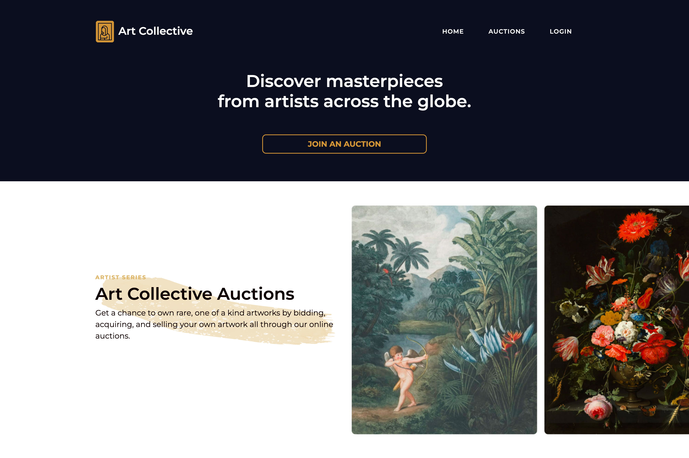
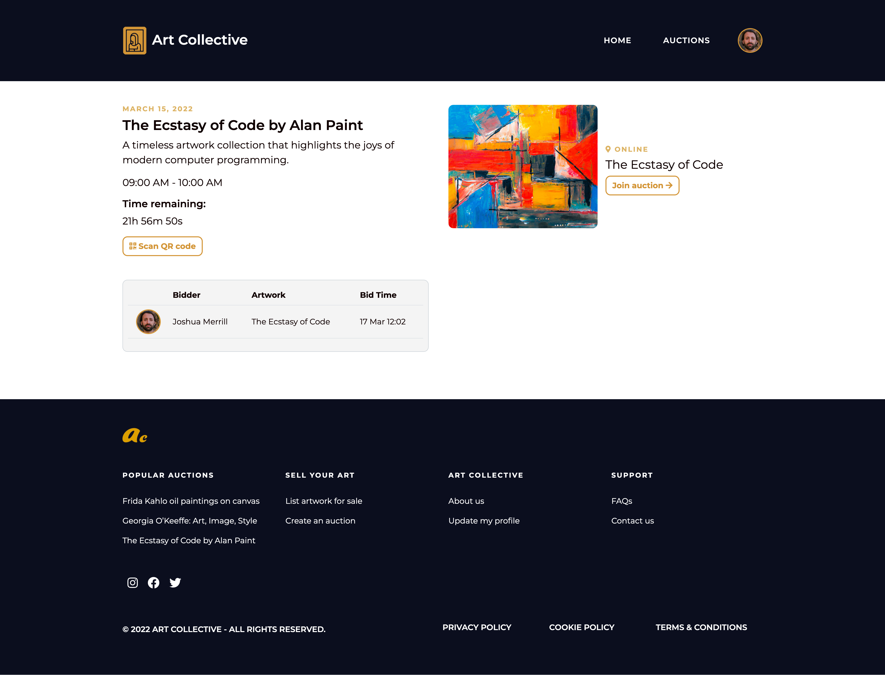

<h1>Art Collective</h1>

## Description

Art Collective is a small web application that enables artists and art collectors to bid, buy and sell rare artwork to people from around the world.

## Links

- [Repo](https://github.com/josh-merrill/PRIVATE-ART-803)

- [Live](https://www.artcollective.live)

## Screenshots

## Built With

- JavaScript
- Node
- NPM
- Webpack
- HTML
- CSS

## Future Updates

- [ ] Reliable Storage

## Author

**Rohit Jain**

- [Profile](https://github.com/rohit19060 "Rohit jain")
- [Email](mailto:rohitjain19060@gmail.com?subject=Hi "Hi!")
- [Website](https://kingtechnologies.in "Welcome")

## 🤝 Support

Contributions, issues, and feature requests are welcome!

Give a ⭐️ if you like this project!
