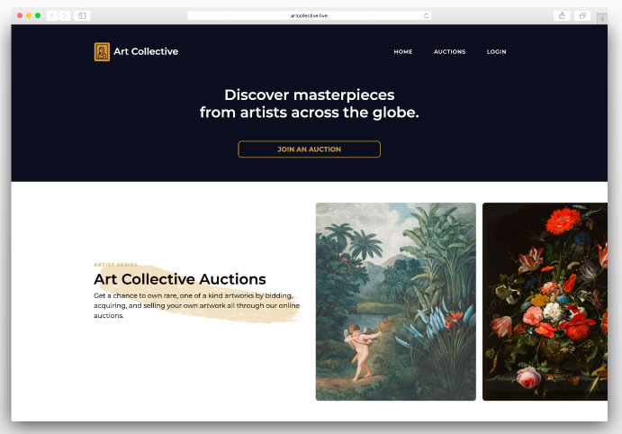

<h1>Art Collective :art:</h1>

## About this project

Art Collective is a small web application that enables artists and art collectors to bid, buy and sell rare artwork to people from around the world. This application was developed by a team of three developers during the final two weeks of Le Wagon Lisbon's batch #803 course.

## Links

- [Repo](https://github.com/josh-merrill/PRIVATE-ART-803)

- [Live website](https://www.artcollective.live)

- [Read more about this project on Medium](https://tenzinrose.medium.com/the-making-of-an-art-auction-house-ba421c886fa8)

## Homepage Screenshot

## Built With

- [Ruby on Rails](https://rubyonrails.org/)
- JavaScript
- [Webpack](https://webpack.js.org/)
- [Yarn](https://yarnpkg.com/)
- [PostgreSQL](https://www.postgresql.org/)
- HTML
- CSS
- [Bootstrap](https://getbootstrap.com/)

## Future Updates

- [ ] Payment integration
- [ ] Email confirmations

## Contributors

**Joshua Merrill**

- [Profile](https://github.com/josh-merrill)
- [Email](mailto:joshmmerrill@outlook.com?subject="Hello!")
- [Website](https://troopl.com/joshmerrill")

**Tenzin Rose**

- [Profile](https://github.com/niznet89)

**Tempestt Woodard**
 
- [Profile](https://github.com/tnwoodard)

## 🤝 Support

Contributions, issues, and feature requests are welcome!

Give a ⭐️ if you like this project!
